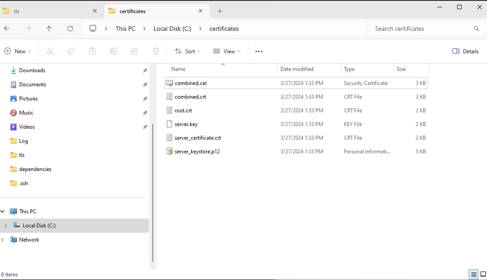
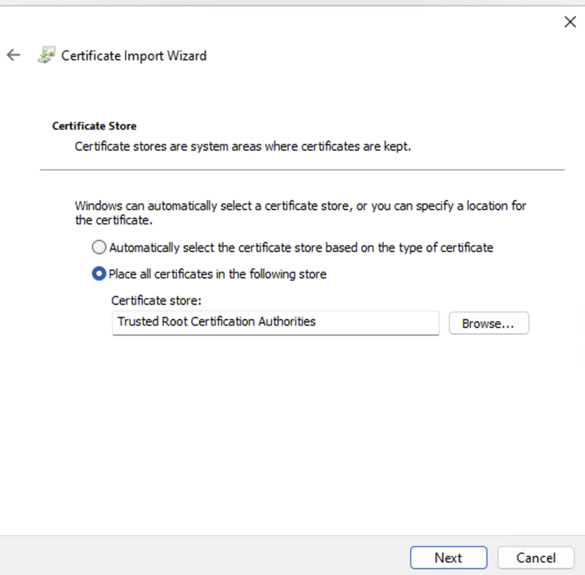
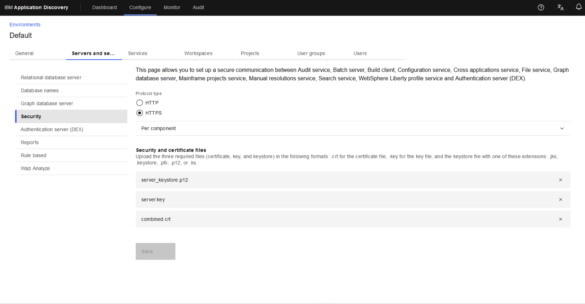
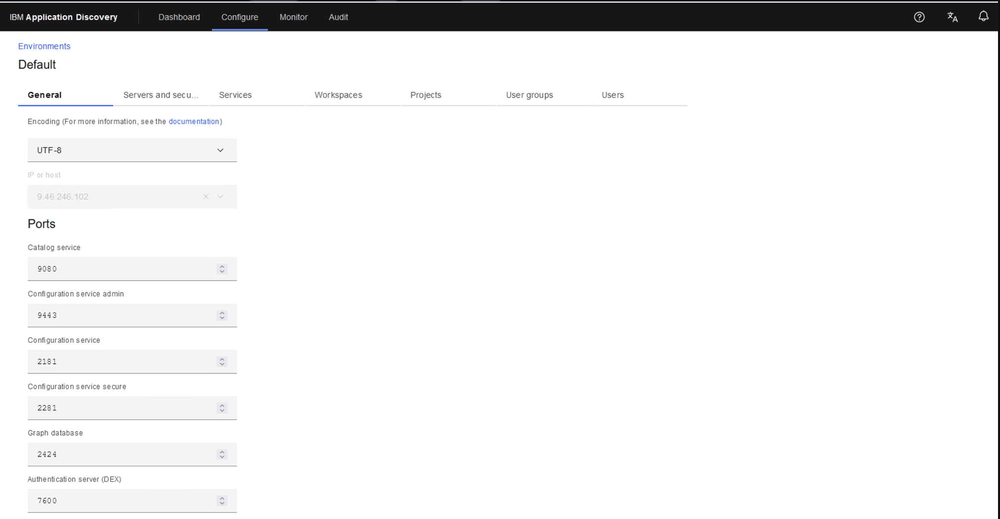
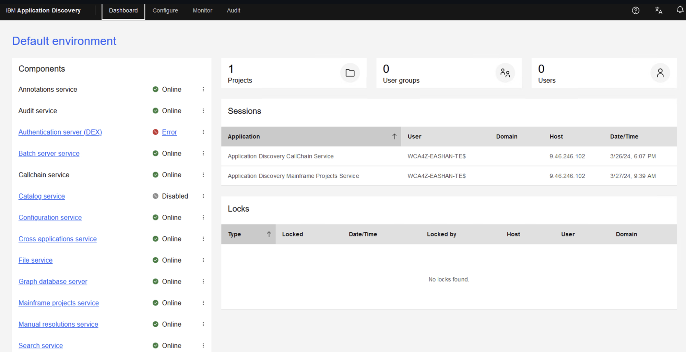

## Overview
<div style={{ borderBottom: '1px solid #000', marginTop: '20px', marginBottom: '20px' }}></div>

This section will walkthrough the automation scripts for the ADDI install. This install will consist of four components:
- Set User Permissions
- Adoptium Java Runtime Environment
- Eclipse
- SQL server and its user permissions
- ADDI

This section will also walkthorugh the configurations for:
- TLS Connections
- DB2 Cloud Database

## Script Walkthrough
<div style={{ borderBottom: '1px solid #000', marginTop: '20px', marginBottom: '20px' }}></div>

### Set User Permissions
Navigate to the appropriate directory:
```powershell
cd assets/papercuts/addi/access_management/
```
Run the automation script
```powershell
./set_user_permissions.ps1
```

### Adoptium Java Runtime Environment
Navigate to the appropriate directory:
```powershell
cd assets/papercuts/addi/java_installation
```
Run the automation script
```powershell
./java_install.ps1
```
Restart the shell and verify that Java is installed by running

```powershell
java -version
```
You should get a similar output
```
PS C:\Users\Administrator> java -version
openjdk version “11.0.22” 2024-01-16
OpenJDK Runtime Environment Temurin-11.0.22+7 (build 11.0.22+7)
OpenJDK 64-Bit Server VM Temurin-11.0.22+7 (build 11.0.22+7, mixed mode)
```

:::note
Allow the ability to run scripts
`Set-ExecutionPolicy RemoteSigned`
:::

### Eclipse Install
:::warning
Run Java Runtime install first
:::

Navigate to the appropriate directory:
```powershell
cd assets/papercuts/addi/java_installation
```
Run the automation script
```powershell
.\install_eclipse.ps1
```

### SQL Server Install and User Permissions

#### **SQL Server Install**
This script will install Microsoft SQL server
Navigate to the appropriate directory:


```powershell
cd assets/papercuts/addi/sql_server_install
```

```powershell
.\sql_server_install.ps1
```

You should get a similar output
```
Attached          : False
BlockSize         : 0
DevicePath        :
FileSize          : 1426724864
ImagePath         : C:\Users\ADMINI~1\AppData\Local\Temp\sql_server_install\SQLServer2019-x64-ENU-Dev.iso
LogicalSectorSize : 2048
Number            :
Size              : 1426724864
StorageType       : 1
PSComputerName    :
------------------------------------------------------------------------------------------------------------------------------------------------------------------------------------------------------------------------------------------------------------------------------------------------------------
Microsoft SQL Server 2019 (RTM) - 15.0.2000.5 (X64)
        Sep 24 2019 13:48:23
        Copyright (C) 2019 Microsoft Corporation
        Developer Edition (64-bit) on Windows 10 Enterprise 10.0 <X64> (Build 22621: ) (Hypervisor)
(1 rows affected)
```

** Note Restart powershell **
```
PS C:\Users\Administrator\Downloads\solution-watsonx-wca4z-main\solution-watsonx-wca4z-main\assets\papercuts\addi\SQL_Server> "SELECT @@version" | sqlcmd
Windows PowerShell
Copyright (C) Microsoft Corporation. All rights reserved.
Install the latest PowerShell for new features and improvements! https://aka.ms/PSWindows
PS C:\Users\Administrator> “SELECT @@version” | sqlcmd
------------------------------------------------------------------------------------------------------------------------------------------------------------------------------------------------------------------------------------------------------------------------------------------------------------
Microsoft SQL Server 2019 (RTM) - 15.0.2000.5 (X64)
        Sep 24 2019 13:48:23
        Copyright (C) 2019 Microsoft Corporation
        Developer Edition (64-bit) on Windows 10 Enterprise 10.0 <X64> (Build 22621: ) (Hypervisor)
(1 rows affected)
PS C:\Users\Administrator>
```

#### **SQL Server User Permissions**
This script will create an addi user on the SQL server and give them the appropriate permissions. Be sure to fill out the .env file with the appropriate values before runing these scripts.
Navigate to the appropriate directory:
```powershell
cd assets/papercuts/addi/sql_server_install
```

```powershell
.\sql_user_setup.ps1
```

:::note
If you are having issues with ADDI Server not connecting to the SQL Server you can do the following:
:::

Open powershell as an admin
```powershell
sqlcmd
>> 1 ALTER LOGIN my_user WITH PASSWORD='me?*L=OchopRlx@9woc', CHECK_POLICY= OFF, CHECK_EXPIRATION = OFF;
>> 2 GO
```

Try again and you should now be able to login


### ADDI Install

:::note
ADDI installer executable is sitting in a personal COS bucket (User will have to store executable somewhere)
:::

First we are going to download the executable for ADDI

Nagivate to this [link](https://w3east-limited-use.cpc.ibm.com/isc/esd/dswdown/home?ticket=Xa.2%2FXb.ddeX-Pn5_UKDYD1s3YpYVy-E9HPU6DcxxO4Gkg%2FXc.%2FXd.%2FXf.%2FXg.12728081%2FXi.%2FXY.knac%2FXZ.egtpZ_CjXOeNUEnHr5jNVMB0ZKkGNna0)
1. Select "Part Number" below the "Search Options" label
2. Search "M0H2CML"
3. Select "HTTPs" as the download method
4. Press "Search" and download the file

Navigate to the appropriate file:
```powershell
cd assets/papercuts/addi/install_addi.ps1
```

On line 48 change the ```$addi_endpoint_install_binary``` value to the directory with the downloaded executable from above

```powershell
$addi_endpoint_install_binary="[executable file path]"
```

Run:
```powershell
cd assets/papercuts/addi/install_addi.ps1
```
Be sure to complete the install by configuring ADDI through a web browser. If the page does not open automatically while the install script is running, navigate to this URL: https://localhost:9443/ad/admin/setup.


Once ADDI has been installed, the next step is to install refactor on the refactor host, using the environmnent ID and host port from this ADDI host.

### Configuring the certs on the ADDI host

Use the helper function to install OpenSSL
```powershell
.\dependencies\install_open_ssl.ps1
```

Next, update the `tls/.env` file where it mentions `change this`. you can use the default values or change them if you'd like
```bash
KeyPass="password" # default
KeyStorePath="C:\certificates\server_keystore.p12" # default
CertificatePath="C:\certificates\" # default
CertificatePathRoot="C:\certificates\root.crt" # default
RootFilePath="C:\root\certs\root.crt" # default
Username="Administrator" # change this
AddiIP=9.46.246.102 # change this
RefactorIP=9.46.246.104 # change this
JreCaCertsPath="C:\Program Files\Eclipse Adoptium\jre-11.0.22.7-hotspot\lib\security\cacerts" # change this
```

Then you can run the helper script `.\tls_certs_configuration.ps1` to generate the following files.
- `combined.cer`
- `combined.crt`
- `root.crt`
- `server_key`
- `server_certificate.crt`
- `server_keystore.p12`

You should get a similar output

```
C:\Users\oscar\Documents\oscars_dir\solution-watsonx-wca4z\assets\papercuts\addi\tls [papercuts/tls_certs_patch_1 ↓1 +4 ~0 -0 !]> .\tls_certs_configuration.ps1
Configure TLS Certs and Keystores
Environment variable 'AddiIP = 9.46.246.102' is not set.
.
.
.
Environment variable 'USERPROFILE = C:\Users\Administrator' is not set.
Environment variable 'windir = C:\Windows' is not set.
Directory C:\certificates\ does not exist... creating one now


    Directory: C:\


Mode                 LastWriteTime         Length Name
----                 -------------         ------ ----
d-----         3/27/2024   1:33 PM                certificates
GenerateKeyPair KeyStorePath: C:\certificates\server_keystore.p12 , KeyPass: password , FQDN: wca4z-eashan-test-winaddi
Export-CertificateToPfx KeyStorePath: C:\certificates\server_keystore.p12 , CertificatePath: C:\certificates\, KeyPass: password , Filename: server_certificate.crt , fullFilePath: C:\certificates\server_certificate.crt
Certificate stored in file <C:\certificates\server_certificate.crt>
Importing certificate to keystore with alias: self-signed-root
Certificate file not found: server_certificate.crt
ConfigureCerts RefactorIP: 9.46.246.104 , CertificatePath: C:\certificates\
Enter Import Password:

*****************************************************************************************
*  Systems must only be used for conducting IBMs business.                              *
*  IBM may exercise rights to manage and enforce security, monitor use,                 *
*  remove access or block traffic to and from this system, as well as                   *
*  any other rights listed in ITSS.                                                     *
*                                                                                       *
*  Users must comply with DevIT service terms of use, IBM policies,                     *
*  directives and corporate instructions including, import/export of data,              *
*  BCGs, Corporate Instructions, Standards, Addenda as well as all other                *
*  responsibilities listed in ITSS                                                      *
*****************************************************************************************
root@9.46.246.104's password:
root.crt                                                                              100% 1139    76.0KB/s   00:00
Certificate was added to keystore
Certificate was added to keystore
Certificates configured successfully
ImportCertToJavaKeyStore KeyStorePath: C:\certificates\server_keystore.p12 , KeyPass: password
Importing keystore C:\certificates\server_keystore.p12 to C:\Program Files\Eclipse Adoptium\jre-11.0.22.7-hotspot\lib\security\cacerts...
Existing entry alias wca4z-eashan-test-winaddi exists, overwrite? [no]:  yes
Entry for alias wca4z-eashan-test-winaddi successfully imported.
Existing entry alias root exists, overwrite? [no]:  yes
Entry for alias root successfully imported.
Existing entry alias combined exists, overwrite? [no]:  yes
Entry for alias combined successfully imported.
Import command completed:  3 entries successfully imported, 0 entries failed or cancelled

Warning:
The JKS keystore uses a proprietary format. It is recommended to migrate to PKCS12 which is an industry standard format using "keytool -importkeystore -srckeystore C:\Program Files\Eclipse Adoptium\jre-11.0.22.7-hotspot\lib\security\cacerts -destkeystore C:\Program Files\Eclipse Adoptium\jre-11.0.22.7-hotspot\lib\security\cacerts -deststoretype pkcs12".
WARNING: Waiting for service 'IBM Application Discovery Configuration Service
(IBMApplicationDiscoveryConfigurationService) (IBMApplicationDiscoveryConfigurationService)' to stop...
ImportCertToJavaKeyStore completed successfully
Add-RootCertificateToTrustedRoot CertificatePath C:\certificates\root.crt
Root certificate successfully added to trusted root certification authorities store.
Add-RootCertificateToTrustedRoot CertificatePath C:\certificates\combined.crt
Root certificate successfully added to trusted root certification authorities store.
TLS configuration completed successfully.
```


The script should have generated a certificates directory along with these files.


You now have to install the `combined.cer` by right clicking on the file and clicking on `Install Certificate` as `Local Machine` on



You can now upload these 3 files `combined.crt`, `server_keystore.p12` and `server.key` on your IBM Application Discovery Configuration page as below. Click save. **Note A restart might be needed


These values should have changed automatically and if they have not please update the values.
You can update these fields to `UTF-8` and the `IP` of the `Addi` host and the port etc.


Validate everything is good. Configuration service should be online. Sometimes you have to restart the service.

