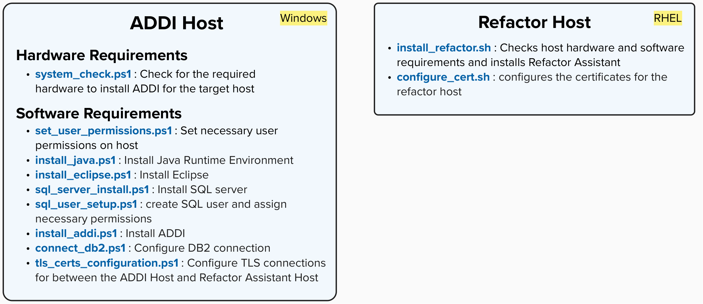

## Overview
---

### Purpose
The purpose of this guide is to ultimately reduce the time it takes to carry out a Watson Code Assistant install by leveraging a series of different automation scripts. These scripts are developed in a decoupled manner allowing the end user to leverage any script that may be relevant to their needs.

:::note
Different components are dependent on other components for the install.
:::

### Install Components and Scripts
This install will require a windows and RHEL host respectively for the ADDI install components and the Refactor Assistant components. For each host there are scripts to check for the required hardware and check / install the necessary software:

### Suggested Script Execution

**We will cover:**
- [System Pre-Flight checks](Automation/Pre-flight-System-Check): The hardware and software requirements needed to carry out the install
- [Refactor Installation](Automation/Refactor-Install):
    - Tools installation
       - Podman
       - Refactor Containers
    - Certificate Configuration
- [ADDI Install](Automation/ADDI-Install): A walkthrough of the different prerequisite installs along with the ADDI install itself
    - Set necessary User permissions
    - Java Runtime Environment install
    - Eclipse Install
    - SQL server install and permissions
    - ADDI Installation
        - TLS and Certifcate configurations
        - DB2 Cloud Database Configuration