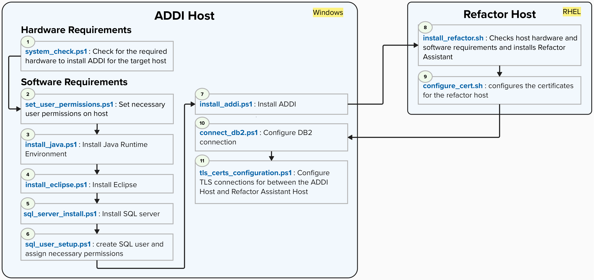

## Overview
---

### Purpose
The purpose of this guide is to reduce the time it takes to carry out a Watson Code Assistant install by leveraging helper automation scripts we have built in house. These scripts are developed in a decoupled manner allowing the end user to leverage any script that may be relevant to their needs.
For example, you may be in a situation where some of the pre-reqs have already been installed such as MSSQL Server or Java etc.

The helper functions automate the following:
- Access Management
- Installation of IBM AD Analyze Client (ADDI) and Watson X Code Assistant for Z.
- Installation of Microsoft SQL Server 2019 (RTM) - 15.0.2000.5 (X64)
- Installation and configuration of Java 11
- DB2 Configuration
- Configuration && Creation of TLS/Certs for Refactor Assistant Host and ADDI Host
- Verifies available RAM, storage and CPU cores.
- Installs Podman, OpenSSL

### Install Components and Scripts
This install will require a Windows and RHEL host respectively for the ADDI install and the Refactor Assistant components. For each host there are scripts to check for the required hardware and check / install the necessary software.

#### **Suggested Script Execution**

**We will cover:**
- [System Pre-Flight checks](Automation/Pre-flight-System-Check): The hardware and software requirements needed to carry out the install
- [Refactor Installation](Automation/Refactor-Install):
    - Tools installation
       - Podman
       - Refactor Containers
    - Certificate Configuration
- [ADDI Install](Automation/ADDI-Install): A walkthrough of the different prerequisite installs along with the ADDI install itself
    - Set necessary User permissions
    - Java Runtime Environment install
    - Eclipse Install
    - SQL server install and permissions
    - ADDI Installation
        - TLS and Certifcate configurations
        - DB2 Cloud Database Configuration